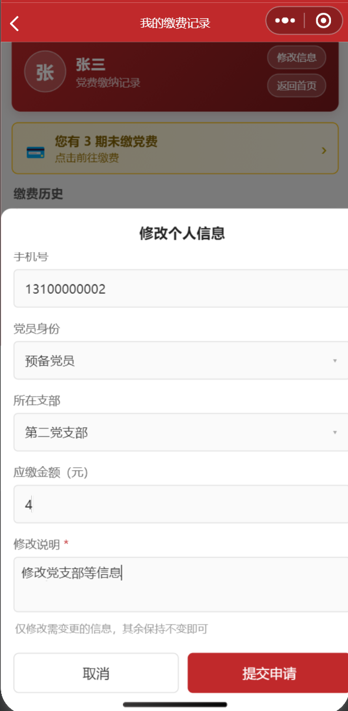
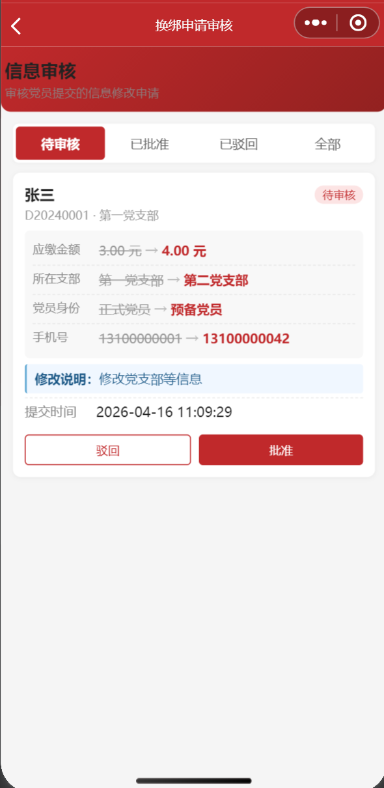

# 党费缴纳管理系统

基于微信小程序 + Python Flask 的党费收缴全流程线上管理系统，适用于高校院系级党委 / 党总支日常使用。

## 界面预览

### 党员端

<table>
  <tr>
    <td align="center"><b>首页</b></td>
    <td align="center"><b>身份绑定</b></td>
    <td align="center"><b>缴费记录</b></td>
    <td align="center"><b>修改个人信息</b></td>
  </tr>
  <tr>
    <td></td>
    <td></td>
    <td></td>
    <td></td>
  </tr>
</table>

### 管理端

<table>
  <tr>
    <td align="center"><b>超级管理员看板</b></td>
    <td align="center"><b>支部管理员看板</b></td>
    <td align="center"><b>成员管理</b></td>
    <td align="center"><b>信息审核</b></td>
  </tr>
  <tr>
    <td></td>
    <td></td>
    <td></td>
    <td></td>
  </tr>
</table>

## 功能特性

### 党员端

- 微信授权登录，绑定党员身份（工号 / 学号 + 手机号）
- 查看本人各期次缴费状态（已缴 / 未缴）
- 微信支付在线缴纳党费（支持 mock 模式演示）
- 申请修改手机号、党员身份、所在支部等个人信息（待管理员审核）

### 支部管理员端

- 查看本支部缴费看板：总人数、已缴 / 未缴、已收金额、进度条
- 管理本支部党员名册（新增、编辑、停用）
- 审核党员信息变更申请（支持批准 / 驳回，显示变更对比）
- 导出本支部缴费明细 Excel

### 超级管理员端（全院）

- 跨支部汇总看板：环形图 + 各支部进度条，支持按期次 / 支部筛选
- 一键确认到账（批量将已支付标记为到账）
- 成员管理：跨支部增删改查、Excel 批量导入、解绑微信
- 期数管理：新建缴费期次，按成员类型配置应缴金额
- 支部管理：新增 / 修改支部及负责人
- 账号管理：创建 / 启停支部管理员账号
- 信息审核：审批 / 拒绝手机号及信息变更申请
- 导出全院缴费明细 Excel

## 技术栈

| 层     | 技术                                |
| ------ | ----------------------------------- |
| 前端   | 微信小程序（原生 WXML / WXSS / JS） |
| 后端   | Python 3.10+ / Flask 3.0            |
| 数据库 | SQLite（单文件，零配置）            |
| 鉴权   | JWT（管理员）/ 微信 OpenID（党员）  |
| 支付   | 微信支付 v3（可切换 mock 模式演示） |

## 快速开始

详细步骤见部署指南 → [docs/deployment.md](docs/deployment.md)

```bash
# 1. 克隆项目
git clone <仓库地址>
cd party-fee-manager

# 2. 安装后端依赖
cd backend
pip install -r requirements.txt

# 3. 初始化数据库 + 写入演示数据
python -c "from database import init_db; init_db()"
python seed_demo.py

# 4. 配置微信小程序凭证（党员端必须；管理员端可跳过）
#    在 backend/config.py 填入 APPID 和 APP_SECRET
#    在 miniprogram/project.config.json 填入 appid

# 5. 启动后端
python app.py
# → http://localhost:5000

# 6. 在微信开发者工具中打开 miniprogram/ 目录
#    详情 → 本地设置 → 勾选「不校验合法域名」，点击「编译」即可预览
```

演示账号（运行 `seed_demo.py` 后有效）：

| 账号     | 密码      | 角色                   |
| -------- | --------- | ---------------------- |
| admin    | admin123  | 超级管理员             |
| branch01 | branch123 | 支部管理员（第一支部） |


## 目录结构

```
party-fee-manager/
├── backend/               # Flask 后端
│   ├── app.py             # 入口
│   ├── config.py          # 配置（AppID / Secret 等）
│   ├── database.py        # 建表 & 数据库连接
│   ├── seed_demo.py       # 匿名演示数据初始化
│   ├── auth.py            # JWT 鉴权中间件
│   ├── requirements.txt
│   └── routes/            # 各模块路由
│       ├── admin_login.py
│       ├── super_admin.py
│       ├── branch_admin.py
│       ├── payment.py
│       └── user.py
├── miniprogram/           # 微信小程序前端
│   ├── app.js / app.json
│   ├── utils/api.js       # 请求封装
│   └── pages/
│       ├── index/         # 首页
│       ├── admin/         # 管理员端页面
│       └── user/          # 党员端页面
├── docs/
│   ├── deployment.md      # 详细部署指南
│   └── images/            # README 截图
└── .gitignore
```

## 配置说明

### 小程序 AppID

在 `miniprogram/project.config.json` 中填入你自己的 AppID：

```json
{
	"appid": "你的AppID"
}
```

> AppID 在 [微信公众平台](https://mp.weixin.qq.com) → 开发管理 → 开发设置 中获取。

### 后端环境变量

所有敏感配置推荐通过**环境变量**注入，也可直接在 `backend/config.py` 中填写默认值（仅限本地调试）：

| 环境变量                            | 说明                                   |
| ----------------------------------- | -------------------------------------- |
| `APPID`                             | 微信小程序 AppID                       |
| `APP_SECRET`                        | 微信小程序 AppSecret                   |
| `JWT_SECRET`                        | JWT 签名密钥（生产必须修改）           |
| `PAY_MODE`                          | `mock`（演示）/ `real`（真实微信支付） |
| `MCHID` / `APIV3_KEY` / `SERIAL_NO` | 微信支付配置（`PAY_MODE=real` 时需要） |

## License

MIT 协议，数据库文件已在 `.gitignore` 中排除，不会带着真实数据上传。敏感配置（AppID、AppSecret、JWT 密钥）通过环境变量注入，仓库中只保留占位符。

如果有类似场景，欢迎直接拿去改。有问题开 Issue，PR 也欢迎。