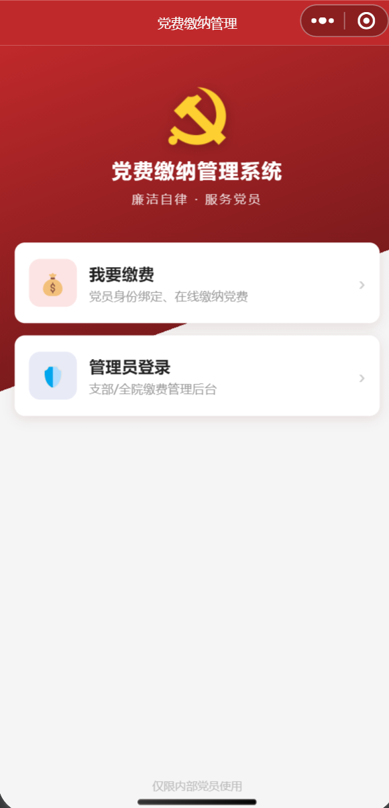
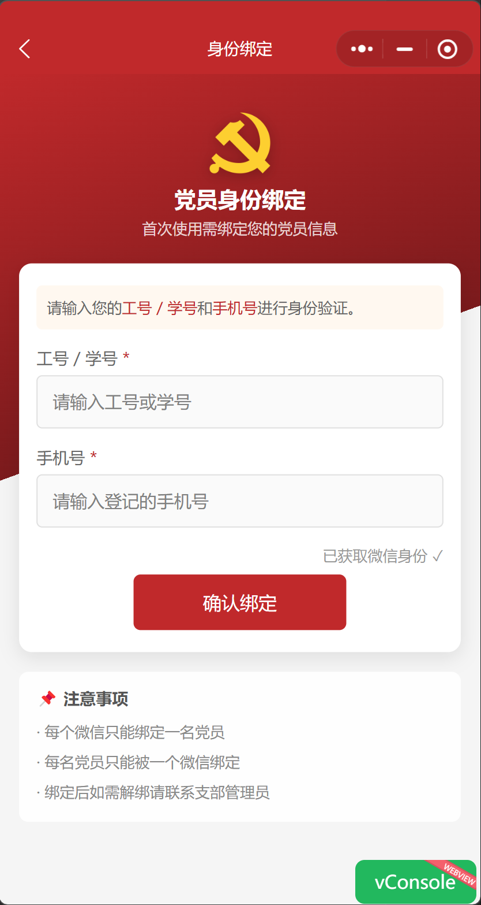
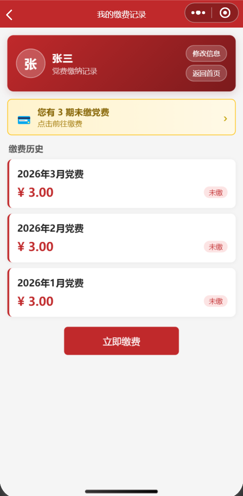
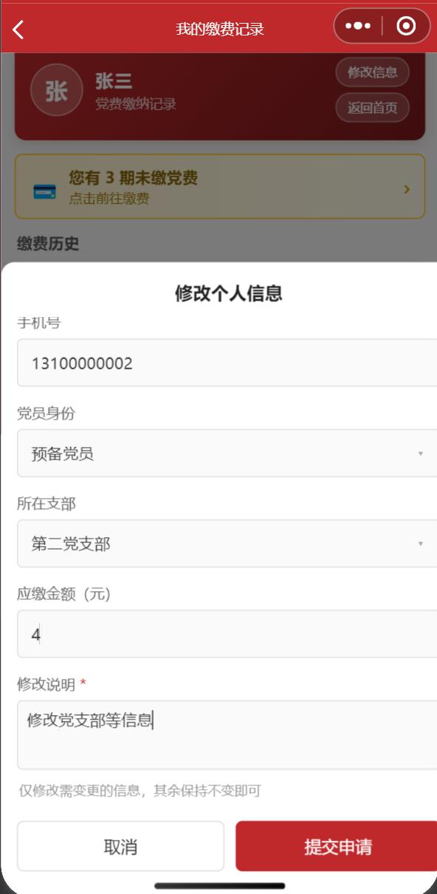
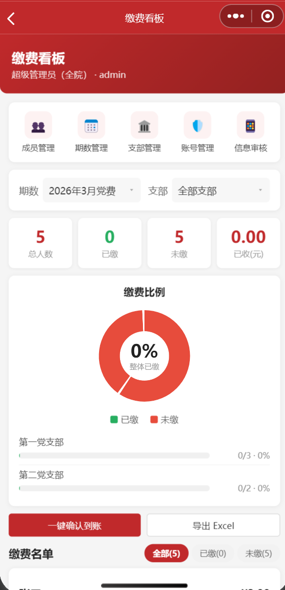
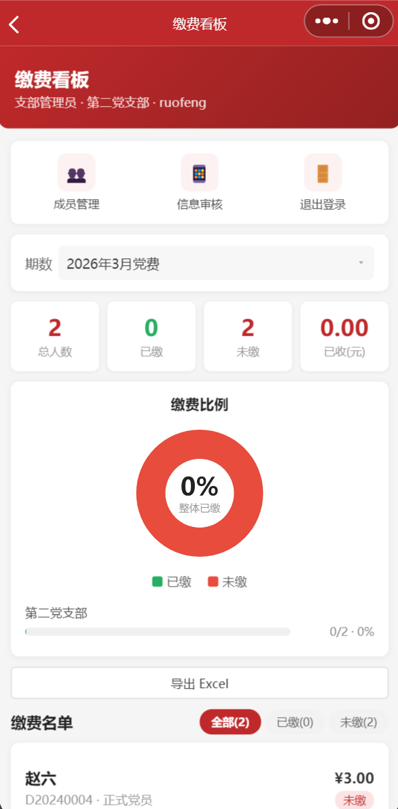
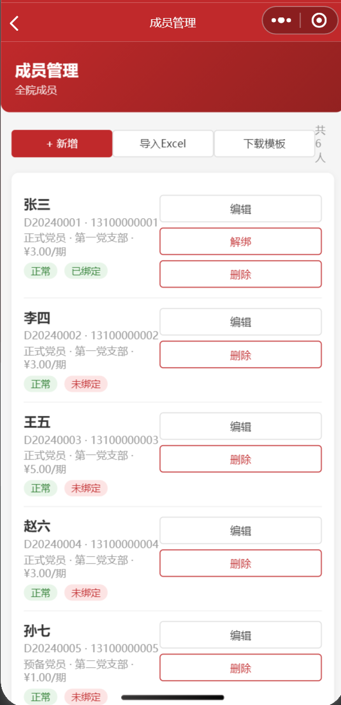
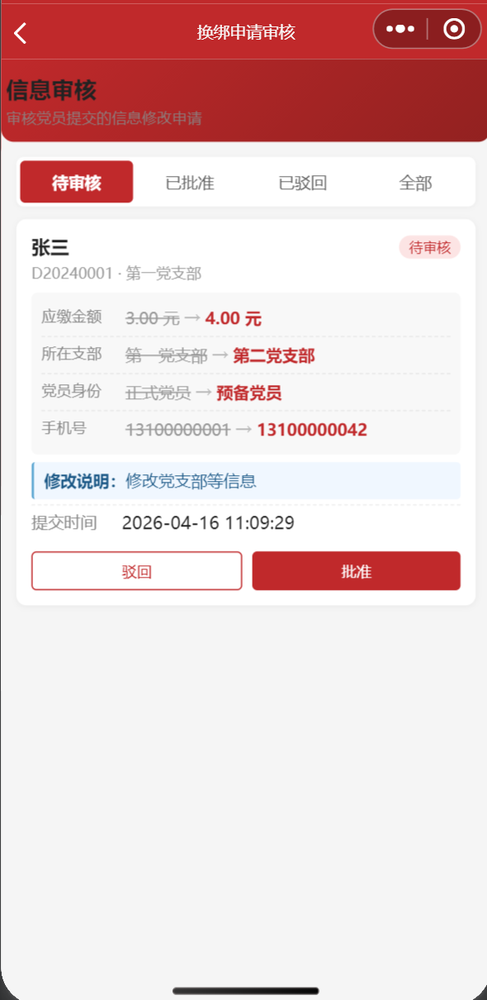

# 用微信小程序 + Flask 做一个党费管理系统

> 从"每次收党费都得挨个发消息追"到"党员自己打开微信就缴了"，做了这个小工具，顺手开源出来。
>
> GitHub：[party-fee-manager](https://github.com/cairangxianmu/party-fee-manager)

---

## 背景

每到收党费，流程大概是这样：管理员群里发通知，等一圈，再发一遍，有人现金、有人转账、有人说"我上次交了吧"，月底对账发现台账和实际金额对不上。

解决方案其实不复杂——做个小程序，党员自己进来缴费，记录自动生成，管理员实时看进度。

---

## 界面预览

### 党员端

<table>
  <tr>
    <td align="center"><b>首页</b></td>
    <td align="center"><b>身份绑定</b></td>
    <td align="center"><b>缴费记录</b></td>
    <td align="center"><b>修改个人信息</b></td>
  </tr>
  <tr>
    <td></td>
    <td></td>
    <td></td>
    <td></td>
  </tr>
</table>

### 管理端

<table>
  <tr>
    <td align="center"><b>超级管理员看板</b></td>
    <td align="center"><b>支部管理员看板</b></td>
    <td align="center"><b>成员管理</b></td>
    <td align="center"><b>信息审核</b></td>
  </tr>
  <tr>
    <td></td>
    <td></td>
    <td></td>
    <td></td>
  </tr>
</table>

---

## 功能

### 党员端

首次使用需要输入工号 / 学号 + 手机号完成身份绑定，系统将微信 OpenID 与党员信息关联，之后打开直接识别身份，不用重复操作。每个微信只能绑一个人，每个人也只能绑一个微信。

绑定后可以看到自己所有期次的缴费状态，未缴的高亮提示，点击直接跳到支付页面。支持微信支付，同时内置了 mock 模式，不需要真实商户号也能跑通完整缴费流程，方便演示。

如果需要修改手机号、党员身份、所在支部等信息，可以在小程序内提交变更申请，管理员审核通过后生效，防止信息被随意修改。

### 管理端

系统设计了两级角色：**超级管理员**管全院，**支部管理员**只看自己支部，两者数据严格隔离。

超管看板用环形图展示全院整体缴费比例，下方按支部分组显示进度条，支持按期次和支部筛选。"一键确认到账"可以批量将已支付记录标记为到账，不用逐条处理。成员管理支持单条录入和 Excel 批量导入。

信息审核页面以变更对比的方式展示每条申请，旧值划线、新值加粗标红，管理员能直观看出改了什么，点击批准或驳回即可。

---

## 技术实现

### 整体结构

```
微信小程序（WXML / WXSS / JS）
         ↕ wx.request / HTTPS
Flask REST API（Python）
         ↕
SQLite 数据库（单文件）
```

前后端完全分离，小程序只负责渲染和交互，业务逻辑全在后端。

### 鉴权：两套并行

**管理员**走用户名 + 密码，登录后后端签发 JWT，payload 里带 `role`（super / branch）和 `branch_id`，后续请求通过 `Authorization: Bearer <token>` 鉴权。权限装饰器从 token 中读取角色，支部管理员调全院接口直接返回 403。

```python
def require_super(f):
    @wraps(f)
    def decorated(*args, **kwargs):
        token = request.headers.get("Authorization", "").replace("Bearer ", "")
        payload = jwt.decode(token, JWT_SECRET, algorithms=["HS256"])
        if payload["role"] != "super":
            return jsonify({"code": 403, "msg": "权限不足"})
        g.admin_id = payload["sub"]
        return f(*args, **kwargs)
    return decorated
```

**党员**走微信 OpenID 体系：小程序调 `wx.login()` 拿到临时 code，后端用 APPID + AppSecret 向微信换取 OpenID，查库匹配党员记录后签发党员专用 JWT。OpenID 是微信给每个用户在特定小程序下的唯一标识，不会变、不会失效，用来做持久化身份绑定很合适。

数据隔离同样在后端保证：支部管理员的所有查询都自动追加 `WHERE branch_id = ?`，从 SQL 层面隔开，不依赖前端传参。

### 路由按角色拆文件

```
routes/
├── admin_login.py    # 管理员登录（flask-limiter 频率限制，防爆破）
├── super_admin.py    # 超管：成员 CRUD、期数、支部、账号、导出 Excel
├── branch_admin.py   # 支部管理员：成员查询、审核
├── payment.py        # 微信支付回调 & 确认到账
└── user.py           # 党员端：登录、查记录、提交申请
```

### 数据库选型

用户量有限（数十到数百人），SQLite 的几个特点很适合这个场景：零配置、单文件便于备份、开启 WAL 模式后支持读写并发。如果未来规模扩大，把 `get_db()` 换成 PostgreSQL 连接，其余代码基本不用动。

### 前端请求封装

小程序用原生开发，没有引入 UI 框架。`utils/api.js` 统一处理鉴权头、401 过期跳转和错误提示，各页面只需调用 `api.post / api.get`：

```javascript
const res = await api.post('/admin/login', { username, password })
```

请求头里带了 `ngrok-skip-browser-warning: true`，跳过 ngrok 免费版在浏览器侧插入的提示页，真机调试不受影响。

---

## 部署

### 环境要求

| 工具 | 说明 |
|------|------|
| Python 3.10+ | 后端运行环境 |
| 微信开发者工具 | 最新稳定版，用于小程序调试 |
| 微信小程序 AppID | 在[微信公众平台](https://mp.weixin.qq.com) → 开发管理 → 开发设置中获取，个人测试号即可 |
| [ngrok](https://ngrok.com/download) | 真机调试时做内网穿透（可选） |

### 后端

```bash
git clone https://github.com/cairangxianmu/party-fee-manager.git
cd party-fee-manager/backend

pip install -r requirements.txt

# 初始化数据库
python -c "from database import init_db; init_db()"

# 写入演示数据（可选，会清空现有数据）
python seed_demo.py

python app.py
# → http://localhost:5000
```

演示数据包含 2 个支部、5 名在册党员（张三 / 李四 / 王五等匿名示例）和 2 个缴费期次，部分已缴、部分未缴，可以直接看到看板上的统计效果。

演示账号：

| 账号 | 密码 | 角色 |
|------|------|------|
| admin | admin123 | 超级管理员 |
| branch01 | branch123 | 支部管理员（第一支部） |

凭证推荐通过环境变量注入，避免写入代码：

```bash
export APPID=wxxxxxxxxxxx
export APP_SECRET=xxxxxxxxxxxxxxxx
python app.py
```

也可以直接在 `backend/config.py` 填写默认值，仅限本地调试。

### 微信开发者工具

1. 打开微信开发者工具，选择「小程序」→「导入项目」，目录选择 `miniprogram/`
2. 在 `miniprogram/project.config.json` 填入你的 AppID
3. 详情 → 本地设置 → 勾选**「不校验合法域名」**，否则 localhost 请求会被拦截
4. 点击**编译（Ctrl+B）**

`miniprogram/app.js` 里的 `baseUrl` 默认指向 `http://localhost:5000`，模拟器调试直接可用。

### 真机调试

微信真机预览要求后端使用 HTTPS，本地可以用 [ngrok](https://ngrok.com/download) 做内网穿透。注册账号、下载安装后完成 authtoken 配置，然后：

```bash
ngrok http 5000
# 输出类似：Forwarding  https://xxxx.ngrok-free.app -> http://localhost:5000
```

将该地址填入 `miniprogram/app.js` 的 `baseUrl`，重新编译后点击「预览」扫码，即可在真机上体验完整流程，包括微信授权登录和支付。

注意 ngrok 免费版每次重启地址会变，重启后需要更新 `baseUrl` 并重新编译。

### 正式上线

日常演示和开发不需要关注这部分，有实际上线需求时参考：

**微信支付**：`config.py` 中 `PAY_MODE` 默认为 `mock`。接入真实支付需要开通微信商户号，获取 `MCHID`、`APIV3_KEY`、商户 API 证书（`apiclient_key.pem`）和 `SERIAL_NO`，填入配置后将 `PAY_MODE` 改为 `real`，并配置公网 HTTPS 回调地址 `NOTIFY_URL`。

**JWT 密钥**：将 `JWT_SECRET` 替换为随机字符串：

```bash
python -c "import secrets; print(secrets.token_hex(32))"
```

**服务器部署**：用 `gunicorn` + `nginx` 替代 Flask 开发服务器，配置 Let's Encrypt SSL 证书（微信小程序正式版强制要求 HTTPS）。SQLite 适合中小规模，数据量大时可迁移到 PostgreSQL。
